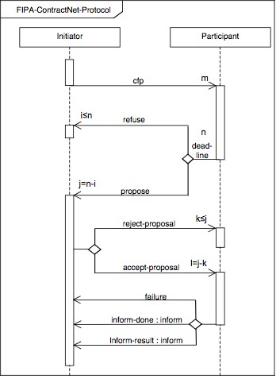

# mas-shift-scheduling
A solution for shift scheduling using a Multi-agent System with Contract Net Protocol communication.

{align=center}

{ width="800" height="600" style="display: block; margin: 0 auto" }

{align=center}